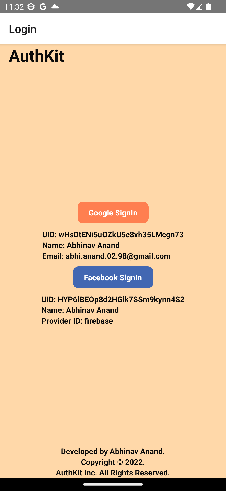
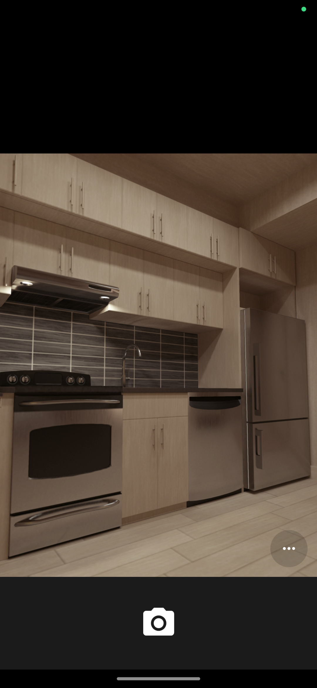
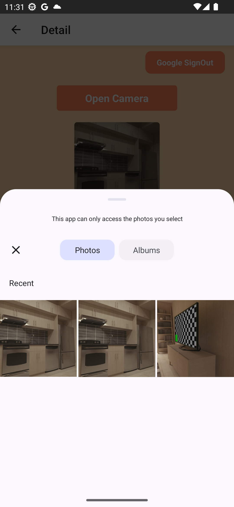
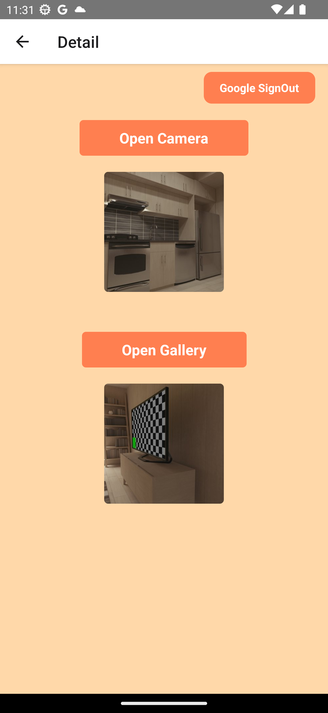

# React-Native-Auth

## Hi, Ryan. This is React Native app combined with auth-kit.

### Screenshot:

### ` Login Screen `

### ` Camera `

### ` Gallery `

### ` Detail Screen `

### Implementation Setups

#### 1. git clone https://github.com/OleksandrBashchenko/RN-Auth.git
#### 2. cd RN-Auth
#### 3. npm install
#### 4. npm start